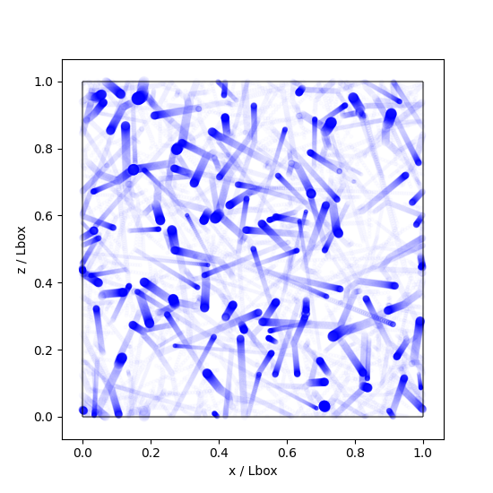

# Coalescence  
Brute force simulation of droplet growth in clouds via coalescence  

  

Edit simulation parameters in `Global_Constants.cpp` to suit your needs.  

To compile,  
```
$ g++ Coalescence.cpp -o Coalescence
```

To run the code,  
```
$ ./Coalescence initial_conditions
```
Here, the code will create a new file named `initial_conditions_0.txt` where it will write the generated initial conditions. Alternatively, the user may supply their own initial conditions similar in format as `sample_ic.txt`. Some alterations to `Coalescence.cpp` may be needed, along with a recompilation.  

Features  
1. Forces: Gravity, Stokes' drag
2. Collisions: Merger (coalescence), bounce (inelastic collision)
3. RK4 time integration
4. Periodic boundary condition
5. Oscillating Taylor Green vortices as background flow field

Performance on 1 intel i5 CPU core:  
<p align="center"> </p>  

The `Vector3D.cpp` and `Particle.cpp` classes contain tools to handle vector algebra and spherical particles' collisions and mergers. You are welcome to use these in your own simulations.  
